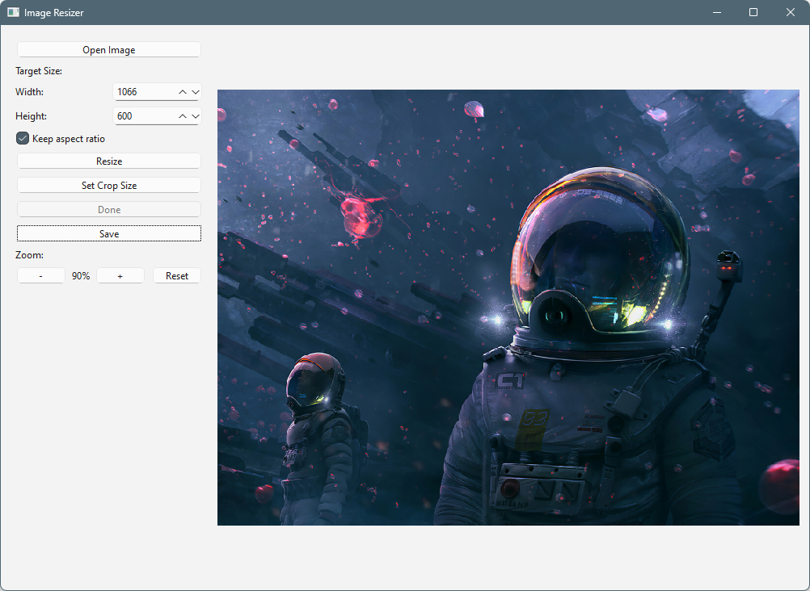

# Image Resizer

Приложение на PyQt6 для изменения размера и обрезки изображений с интерактивными функциями.



## Возможности

- Открытие и просмотр изображений (PNG, JPG, JPEG, BMP, GIF)
- Изменение размера с сохранением пропорций (опционально)
- Интерактивный инструмент обрезки с перемещаемым и изменяемым прямоугольником
- Настраиваемый размер области обрезки с предпросмотром
- Функции масштабирования (увеличение/уменьшение/сброс)
- Сохранение обработанных изображений в различных форматах (PNG, JPG, BMP)

## Требования

- Python 3.x
- PyQt6

## Установка

1. Установите все необходимые зависимости одной командой:
   ```bash
   pip install PyQt6
   ```

   Или для конкретных версий:
   ```bash
   pip install PyQt6==6.4.0
   ```

2. Скачайте скрипт `hard_resize.py` или клонируйте репозиторий

## Использование

1. Запустите приложение:
   ```bash
   python hard_resize.py
   ```
2. Работа с интерфейсом:
   - Кнопка "Open Image" - загрузка изображения
   - Поля "Width/Height" - установка целевого размера
   - Чекбокс "Keep aspect ratio" - сохранение пропорций
   - Кнопка "Resize" - применение изменения размера
   - Кнопка "Set Crop Size" - установка размера области обрезки
   - Кнопка "Done" - применение обрезки
   - Кнопка "Save" - сохранение результата
   - Кнопки "+/-/Reset" - управление масштабом

## Особенности работы

- Прямоугольник обрезки можно:
  - Перемещать по изображению
  - Изменять размер, потянув за края
- При включенной опции "Keep aspect ratio" изменение одного размера автоматически подбирает второй


## Дополнительная информация

Для работы скрипта требуется только библиотека PyQt6. Если у вас не установлен Python, скачайте его с [официального сайта](https://www.python.org/downloads/).

При возникновении проблем с запуском убедитесь, что:
1. Установлен Python 3.6 или новее
2. Все зависимости установлены корректно
3. Файл скрипта имеет права на выполнение (в Linux/Mac)
